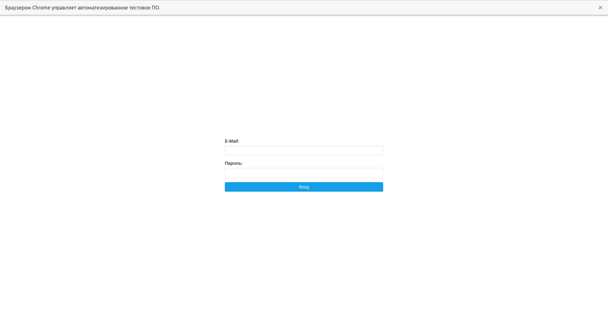

# Authorization form testing.

## Appearance

### Authorization page 
Start page that appears after opening file.

 

### Main page 
Page that appears after entering correct login and password at the authorization page.
 
## How to run tests
----

There are 6 kinds of test markers: 

1. _smoke_ : marker for smoke tests
2. _positive_ : marker for positive tests
3. _negative_ : marker for negative tests
4. _authorization_ : marker for authorization page tests
5. _main_ : marker for main page tests
6. _alert_ : marker for alert window tests

To run one group of marker tests you need to execute:
```
pytest -s -v -m 'marker' file name or nothing to run tests for hole directory
```
To run several markered group you need to execute:
```
pytest -s -v -m 'marker_1 or marker_2' file name or nothing to run tests from hole directory
```

To run only tests that belond to several markered group you need to execute

```
pytest -s -v -m 'marker_1 and marker_2' file name or nothing to run tests from hole directory
```

To run all tests except one group of marker tests you need to execute:

```
pytest -s -v -m 'not marker' file name or nothing to run tests for hole directory
```

For example
```
pytest -s -v -m 'smoke and positive' main_page_test.py
```
run tests from main_page_test.py which are both smoke and positive.

